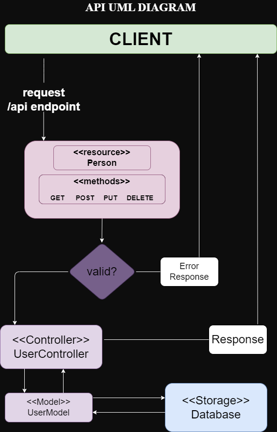

# Simple REST API with Node.js and Express

This is a simple REST API built using Node.js and Express for managing user data with a MongoDB database.



## Table of Contents

- [Introduction](#introduction)
- [Prerequisites](#prerequisites)
- [Installation](#installation)
- [Usage](#usage)
- [Endpoints](#endpoints)
- [Contributing](#contributing)

## Introduction

This Node.js and Express REST API allows you to perform basic CRUD (Create, Read, Update, Delete) operations on user data stored in a MongoDB database. You can create, retrieve, update, and delete user records.

## Prerequisites

Before using this API, ensure you have the following prerequisites installed:

- Node.js: [Download and install Node.js](https://nodejs.org/)
- MongoDB: [Install and set up MongoDB](https://docs.mongodb.com/manual/installation/)

## Installation

 Clone the repository:
   ```bash
   git clone https://github.com/your-username/your-project.git
   cd your-project
   ```

 Install dependencies:
 ```bash
  npm install
 ```

## Usage
Start the server
  ```bash
    npm start
  ```
You can now use the API to perform CRUD operations on user data

## Endpoints
### Create a User
- URL: /api

- Method: POST

- Request Body: JSON object with a "name" field (required)

- Example:
  ```bash
    {
      "name": "Malach Salama"
    }
  ```
- Response: JSON object with the created user's data
- Example:
  ```bash
  {
    "_id": "5fbd34fcaea3bfc125423678",
    "name": "Malach Salama"
  }
  ```

### Retrieve All Users
- URL: /api
- Method: GET
- Response: JSON array containing all user records

### Retrieve a User by ID
- URL: /api/:id
- Method: GET
- Response: JSON object with the user's data or "User not found" if not found


### Update a User by ID
- URL: /api/:id

- Method: PUT

- Request Body: JSON object with the "name" field to update

- Example:
  ```bash
  {
  "name": "Updated Name"
  }
  ```
- Response: JSON object with the updated user's data or "User not found" if not found

### Delete a User by ID
- URL: /api/:id
- Method: DELETE
- Response: JSON object with the deleted user's data or "User not found" if not found


## Contributing
Contributions are welcome! If you would like to contribute to this project, please open an issue or submit a pull request.


   

